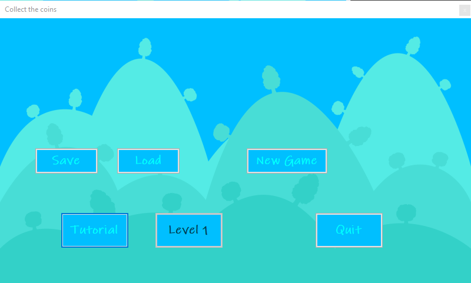
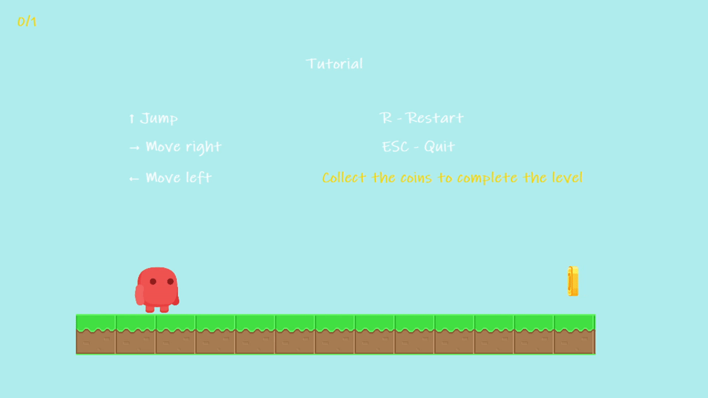

# Collect the coins

Проектната задача е едноставна видео игра во која имаме карактер со кој се движиме низ левелот(формата). Во левелот мораме да собираме парички, а излегуваме од него кога ќе ги собереме сите парички. Постојат препреки кои при судир го враќаат играчот на почеток па затоа треба да се избегнуваат.

При стартување на играта ќе ни се појави формата за главно мени. Постојат неколку опции можеме да зачуваме или да продолжиме од некој претходно зачуван обид. При зачувување на прогресот се зачувува листа од броеви, а при продолжување ја изминуваме листата и ги овозможуваме мапираните копчиња. Стартување на нова игра не враќа на почеток, односно ја празни листата и ги оневозможува копчињата, постои и копче за излез. Копчето за левел 1 е оневозможенo потребно е да се успешно помине туторијалот кој служи за покажување на можностите за играње.



Дивжењето на играчот е стандардно имаме тајмер tMove кој на секое отчукување може да ги поместува X и Y вредностите во зависност од EventArgs на Key Up и Down настаните(event). Најинтересни овде се анимациите на играчот, кој може да се наоѓа во состојба на паѓање, скокање, трчање и мирување. Ваквата функционалност е постигната со шаблонот за развој на софтвер наречен State pattern.



Имплементацијата на шаблонот е следна, потрени ни се транцизиите од состојбите кој ги мапираме во функции, затоа правиме интерфејс.

```C#
    interface IAnimator
    {
        void animate();

        void reload();

        void startRunning();

        void idle();

        void jumpUp();

        void jumpDown();

        void lookLeft();

        void lookRight();
    }
```
Во класата Player имаме промелива за моменталната анимација(состојба), чија метода animate() се повикува од тајмер tAnimator.

```c#
    IAnimator currentAnimation
```

Исто така во класата имаме истанци од сите можни состојби кои го имаат имплементирано интерфејсот IAnimator. Состојбите имаат промлеива Player player која покажува до играчот и во зависност од повиканата функција можат да ја променат моменталната состојба.

```c#
    AnimationIdleRight animationIdleRight { get; set; }
    AnimationRunRight animationRunRight { get; set; }
    AnimationJumpDownRight animationJumpDownRight { get; set; }
    AnimationJumpUpRight animationJumpUpRight { get; set; }

    AnimationIdleLeft animationIdleLeft { get; set; }
    AnimationRunLeft animationRunLeft { get; set; }
    AnimationJumpDownLeft animationJumpDownLeft { get; set; }
    AnimationJumpUpLeft animationJumpUpLeft { get; set; }
```

Пример ако currentAnimation е AnimationRunRight и ја повикаме функцијата currentAnimation.idle() (таа логика се справува во функцијата animationStateChange()) тогаш ќе ја променима моменатлната состојба во мирување AnimationIdleRight.

```c#
    public void idle()
    {
        player.currentAnimation = player.animationIdleRight;
    }
```
Но ако сегашна е AnimationRunRight и повикаме startRunning() функцијата би била празна бидејќи веќе се наоѓаме во состојба на трчање.

```c#
    public void startRunning()
    {

    }
```

Посложените анимации како AnimationRunRight содржат поврзана листа од слики кои ја менуваат моменталнта слика на PictureBox на играчит во следната со повикување на animate() методата од тајмерот tAnimator. А пак листата ја полниме во конструкторот со повикување на AddResources() кој ги зема потребните слики од Resources.

```c#
    Player player;
    LinkedList<Image> listsOfImages;
    LinkedListNode<Image> currentImage;

    public AnimationRunRight(Player pl)
    {
        this.player = pl;
        listsOfImages = new LinkedList<Image>();
        AddResources();
        currentImage = listsOfImages.First;
    }

    protected virtual void AddResources()
    {
        listsOfImages.AddLast(Properties.Resources.characterRun1R);
        listsOfImages.AddLast(Properties.Resources.characterRun2R);
        listsOfImages.AddLast(Properties.Resources.characterRun3R);
        ...
    }

    public void animate()
    {
        player.pictureBox.Image = currentImage.Value;            

        if (currentImage.Next == null)
        {
            currentImage = listsOfImages.First;
        }
        else
        {
            currentImage = currentImage.Next;
        }
    }
```

Со тоа го добиваме ефектот на анимации. Кога ќе ги собереме сите парички го заминуваме левелот и го одклучуваме следниот. Оденсувањето на паричките е задача на CoinManager. Класата го менаџира нивниот број, видливост и анимација. Постојат и препреки кои можат да бидат стационарни и подвижни при судрање со нив играчот се враќа на почеток. Бидејќи паричките, препреките, играчот и подлогите за движење се PictureBox компонетни, се групираат со променливата tag. Кога MovingObstacles проверива дали компонентата е подвижна препреки го проверува тагот, а проверката за дали компонентата се судира(допира) со компонентата на играчот се проверува со Bonds.intersectsWith().


